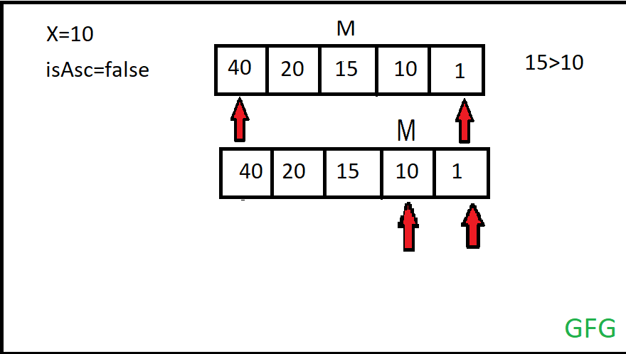

# Order Agnostic Search

**Order-Agnostic Binary Search** is a modified version of **Binary Search algorithm**. Here in this modified binary search comes with one more condition checking. The intuition behind this algorithm is what if the **order of the sorted array is not given**. So here check that the value of the first element is greater or smaller than the last element.
- **If the first element is smaller than the last element**, then if the search key value X is less than the middle of the interval then the end pointer will be changed to middle -1 otherwise start will be changed to middle + 1.
- **If the first element is greater than the last element**, then if the search key value X is less than the middle of the interval then the start pointer will move to the next element of the middle element otherwise the end pointer will move previous to the middle element.

In the end, if the search key value matches with the middle element then the element which was given to the search is found.


## Implementation of Order-Agnostic Binary Search:
Given an array, `arr[]` of size `N` and an element `X` and the array is sorted in any order(**ascending** or **descending**), the task is to find whether the element `X` is present in the array or not. If yes, then print its **index**, else print `-1`.

### Examples
1. **example 1**:
    - **Input:** 
        - arr[] = {40, 10, 5, 2, 1}
        - N = 5
        - X = 10
    - **Output:** 1
    - **Explanation:** The array is sorted in descending order and the element is present at index 1.
        
2. **example 2**:
    - **Input:** 
        - arr[] = {1}
        - N = 1
        - X = 10
    - **Output:** -1 

### Brute Force Approach
The brute force idea would be to linearly traverse the array and check whether the element is present in the array or not. 

### Optimal Approach
The optimal approach is to use **binary search** if the order of sorting of the array was known – ascending/descending. A variation of binary search can be used i.e, Order-Agnostic Binary search as stated below:

Follow the steps below to solve the problem using Order-Agnostic Binary Search:
- Initialize a boolean variable `isAsc` as `true` if `arr[start]` is **less than** `arr[end]` else set it as `false`.
- **Traverse over a while loop** till `start` is **less than or equal** to **end** and perform the following steps:
    - Initialize the variable `middle` as the **average** of `start` and `end`.
    - If `arr[middle]` **equals** `X`, then return *the value of `middle` as the answer*,
    - If the array is in **ascending order** then perform the following steps:
        - If `arr[middle]` is **less than** `X`, then set the value of `start` as  `middle + 1` else set the value of `end` as `middle - 1`.
    - Else, if `arr[middle]` is **greater than** `X`, then set the value of `end` as `middle - 1` else set the value of `start` as `middle + 1`.
- After performing the above steps, return the value of `-1` as the answer as the element is **not found**.

### Iterative implementation of Order-Agnostic Binary Search
``` js
// An iterative binary search function.
function binarySearch(arr, start, end, x) {

    // Checking the sorted order of the given array
    const isAsc = arr[start] < arr[end]

    while (start <= end) {
        let middle = start + Math.floor((end - start) / 2)

        // Check if x is present at mid
        if (arr[middle] == x) return middle

        // Ascending order
        if (isAsc == true) {
            // If x greater, ignore left half
            if (arr[middle] < x) start = middle + 1

            // If x smaller, ignore right half
            else end = middle - 1
        }

        // Descending order
        else {
            // If x smaller, ignore left half
            if (arr[middle] > x) start = middle + 1

            // If x greater, ignore right half
            else end = middle - 1
        }
    }

    // Element is not present
    return -1
}

// Driver Code
const arr = [40, 10, 5, 2, 1]
const x = 10
const n = arr.length

console.log(binarySearch(arr, 0, n - 1, x))
```